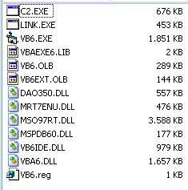



## NanoVB6 \- A fully portable VB6 version \(only \~5MB\!\)

### Description

NanoVB6 is a very compact VB6 version which is smaller than 5 MB when compressed.

It is furthermore fully portable - so that it can be run from a usb stick or on BartPE.
 
### More Info
 

             |
---                |---
**Submitted On**   |2011-03-10 06:10:02
**By**             |[c0rt3x](https://github.com/Planet-Source-Code/PSCIndex/blob/master/ByAuthor/c0rt3x.md)
**Level**          |Intermediate
**User Rating**    |5.0 (40 globes from 8 users)
**Compatibility**  |VB 6\.0
**Category**       |[Complete Applications](https://github.com/Planet-Source-Code/PSCIndex/blob/master/ByCategory/complete-applications__1-27.md)
**World**          |[Visual Basic](https://github.com/Planet-Source-Code/PSCIndex/blob/master/ByWorld/visual-basic.md)
**Archive File**   |[NanoVB6\_\-\_2199503102011\.zip](https://github.com/Planet-Source-Code/c0rt3x-nanovb6-a-fully-portable-vb6-version-only-5mb__1-73790/archive/master.zip)

